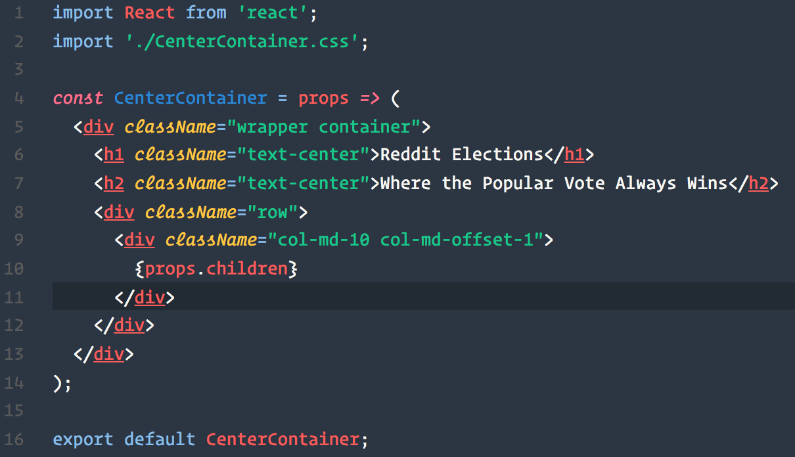

# VSCode Chester Atom
---
### A theme based on the colors used in the [Chester Atom Syntax Theme](https://github.com/csutter/chester-atom-syntax) for Atom. Optimized for use with the Operator Mono Typeface.

### Installation Instructions:

Launch VS Code Quick Open (⌘+P for Mac, CTRL+P for Windows), paste the following command, and press enter.

`ext install vscode-chester-atom`

Visit [https://marketplace.visualstudio.com/items?itemName=chriseckenrode.vscode-chester-atom](https://marketplace.visualstudio.com/items?itemName=chriseckenrode.vscode-chester-atom) for more information.

### Contributing

If you have an improvement, feel free to submit a [pull request](https://github.com/ceckenrode/vscode-chester-atom) along with a screenshot of how the change will affect syntax coloring.

I personally develop primarily HTML, CSS, and JavaScript. So I very much welcome PR's that improve usability with other languages.

### Authors

* Christian Eckenrode

  * [Github](https://github.com/ceckenrode/)
  * [Twitter](https://twitter.com/cseckenrode/)
  * [LinkedIn](https://www.linkedin.com/in/christianeckenrode/)
